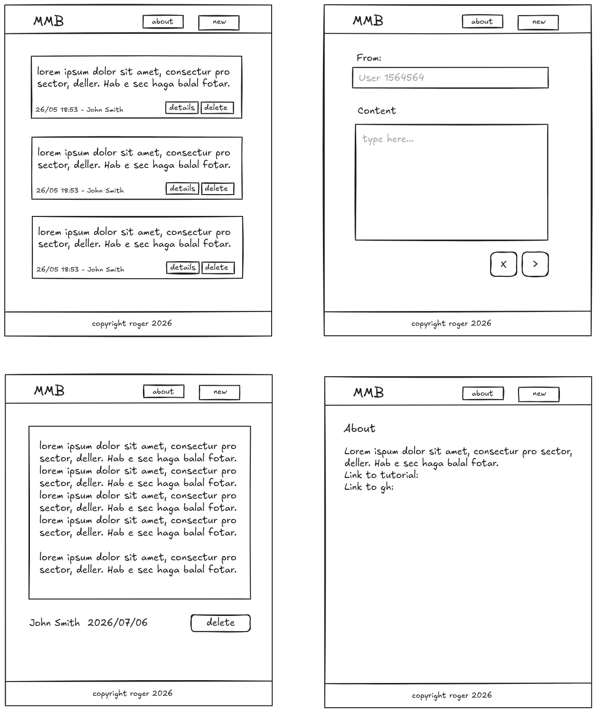

## Mini Message Board

Learning assignmenet from [The Odin Project](https://www.theodinproject.com/lessons/node-path-nodejs-mini-message-board)

## Assignment

1. Set up a basic Express app by installing Express and EJS. Set up a basic index route and run your server. Create the required folders and files as discussed in the previous lessons.
2. We are going to have 2 routes, the index ("/") and a “new message” form ("/new").
3. Create an array at the top of your index router called messages and put a couple of sample messages inside of it like this:

```js
const messages = [
  {
    text: "Hi there!",
    user: "Amando",
    added: new Date(),
  },
  {
    text: "Hello World!",
    user: "Charles",
    added: new Date(),
  },
];
```

4. Next, in your index template (in the "views" folder) loop through the messages array and for each one, display the user, text and the date the message was added. Don’t forget to make your messages available to your template by including it in the res.render ‘locals’ object (e.g. res.render("index", { title: "Mini Messageboard", messages: messages })).
5. Next let’s set up the new message form. In the router add a router.get() for the "/new" route and point it to a template named "form". In the views directory create your form template. Add a heading, 2 inputs (one for the author’s name and one for the message text) and a submit button. To have the form make a network request you will need to define it with both a method and an action like so (we will learn how to handle forms in a later lesson):

```html
<form method="POST" action="/new">put your inputs and buttons in here!</form>
```

6. With your form set up like this, when you click on the submit button it should send a POST request to the url specified by the action attribute, so go back to your index router and add a router.post() for "/new".
7. In order to get and use the data from your form, you will need to access the contents of your form inside router.post() as an object called req.body. The individual fields inside the body object are named according to the name attribute on your inputs (the value of <input name="messageText"> will show up as req.body.messageText inside the router.post function). For this to work as intended, you’ll need to use an app level Express middleware called express.urlencoded() to parse the form data into req.body. You can set this up by adding the following line to your app setup:

```js
app.use(express.urlencoded({ extended: true }));
```

8. In your router.post() take the contents of the form submission and push them into the messages array as an object that looks something like this:

```js
messages.push({ text: messageText, user: messageUser, added: new Date() });
```

9. At the end of the router.post() function use res.redirect("/") to send users back to the index page after submitting a new message.
10. At this point, you should be able to visit /new (it might be a good idea to add a link to that route on your index page), fill out the form, submit it and then see it show up on the index page!
11. Add an “open” button or link next to every message to open a new page with the message details.
12. Push your project to GitHub.
13. You’ll learn how to deploy your app to the web in the next lesson, don’t forget to come back and submit it to the submissions below once you’re done!

## Idea:



## TODO

- [x] boilerplate
- [x] mock data
- [x] view all
- [x] input form
  - [x] redirect to view all
- [x] msg details
- [x] styling

## Requirements

[Bun](https://bun.com/)

## How to Run

```bash
bun install
bun dev
```
